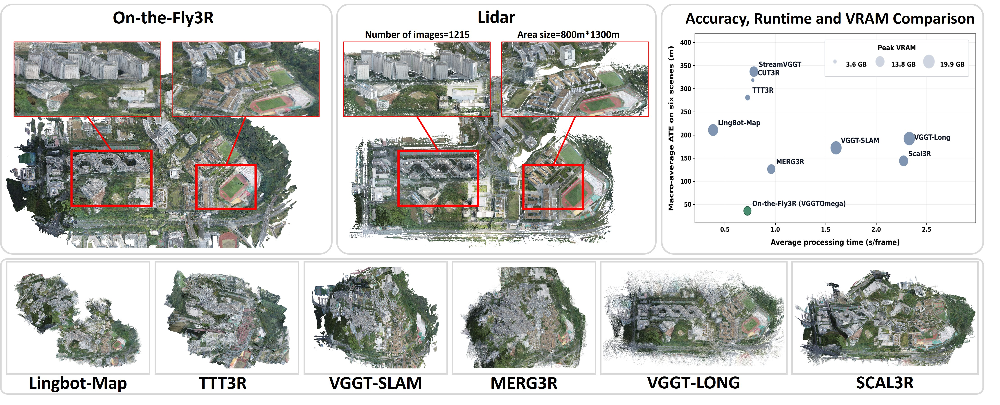
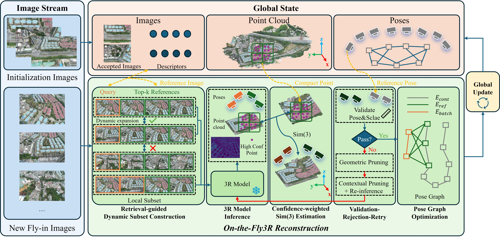
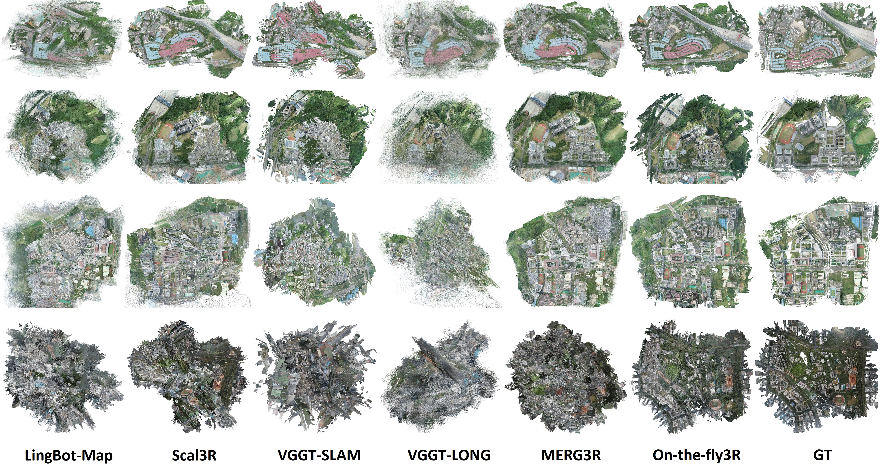

<h1 align="center">On-the-Fly3R</h1>

<h3 align="center">Towards Robust Online 3D Reconstruction with Feed-Forward 3R Models for Large-Scale UAV Scenarios</h3>

<p align="center">
  <a href="https://sh1nzzz.github.io/On_the_Fly3R/">Project Page</a> · <a href="https://arxiv.org/abs/2609.00923">Paper</a>
</p>

<p align="center">
  
</p>

On-the-Fly3R is a robust online 3D reconstruction framework designed for
large-scale UAV image streams. It incrementally reconstructs incoming images
without repeatedly processing the complete sequence, enabling scalable
reconstruction over large and continuously expanding scenes.

The framework combines retrieval-guided dynamic subset construction,
feed-forward 3R model inference, confidence-weighted Sim(3) alignment,
validation-and-retry, and pose-graph optimization. Its model-agnostic design
supports multiple feed-forward 3R backbones, including Pi3, Pi3X, VGGT,
VGGT-Omega, and MapAnything.

## Method Overview

<p align="center">
  
</p>

Given a stream of UAV images, On-the-Fly3R retrieves relevant global
references and dynamically constructs compact local subsets for feed-forward
3R inference. Each local reconstruction is aligned with the global map through
confidence-weighted Sim(3) estimation, followed by validation-and-retry and
pose-graph optimization.

The current release provides:

- SupScene-based image retrieval and retrieval-guided dynamic batching;
- Pi3, Pi3X, VGGT, VGGT-Omega, and MapAnything inference adapters;
- robust point-based Sim(3) alignment with validation and reference-pruning retry;
- final and loop-aware online SE(3) pose-graph optimization with GTSAM;
- camera-pose, run-summary, and PLY point-cloud export;
- an online Viser viewer.

## Installation

The recommended environment is Linux, Python 3.11, PyTorch, and a CUDA-capable
GPU. Install PyTorch and TorchVision for your CUDA version first, then run:

```bash
git clone https://github.com/Sh1nZzz/On_the_Fly3R.git
cd On_the_Fly3R

conda create -n on_the_fly3r python=3.11 -y
conda activate on_the_fly3r

# Install PyTorch and TorchVision for your CUDA version before this step.
bash setup.sh
```

`setup.sh` installs this project, prepares the external `Pi3/` and `SupScene/`
repositories, initializes their nested Git submodules, and applies the
maintained SupScene compatibility patch. Model checkpoints and datasets are
not included in this repository.

Provide the local checkpoints in the configuration file or through command-line
arguments:

- Pi3/Pi3X: `model_checkpoint: /path/to/model.safetensors`
- SupScene: `supscene_weights: /path/to/dinov2_scpp_supscene_1536.pth`

Additional 3R backbones should be installed and prepared according to their
official repositories.

## Quick Start

Place an ordered image sequence in one directory and edit the `editable`
section in `configs/incremental_ablation_template.yaml` for your machine,
dataset, checkpoints, and CUDA devices. Then run:

```bash
python run_on_the_fly3r.py \
  --config configs/incremental_ablation_template.yaml \
  --case ab05_all_on
```

Command-line arguments override values loaded from the configuration file.
For example:

```bash
python run_on_the_fly3r.py \
  --image_dir /path/to/images \
  --output_dir outputs/example \
  --model Pi3X \
  --model_checkpoint /path/to/model.safetensors \
  --supscene_weights /path/to/dinov2_scpp_supscene_1536.pth \
  --inference_device cuda:0 \
  --retrieval_device cuda:0 \
  --enable_register_ref_pruning_retry \
  --enable_pose_graph_optimization \
  --save_ply
```

Incoming images are grouped with retrieval-guided dynamic batching. Alignment
uses compact point correspondences and robust Sim(3) estimation. Pose-graph
optimization runs after incremental reconstruction. The `online_and_final`
mode additionally checks newly accepted frames for loop edges and schedules
online optimization while retaining a final optimization pass.

## Online Viewer

Use the same reconstruction configuration with the Viser entrypoint:

```bash
python view_on_the_fly3r.py \
  --config configs/incremental_ablation_template.yaml \
  --case ab05_all_on \
  --port 8080
```

Open `http://localhost:8080` in a browser after the server starts.

## Outputs and Evaluation

Each run writes its artifacts under `output_dir`. Depending on the enabled
options, these include:

- `camera_poses.npz`: reconstructed camera poses;
- `summary.json`: resolved settings, timing, and reconstruction statistics;
- `resolved_config.json`: the effective configuration for the run;
- `batch_logs.json`: optional per-batch diagnostics;
- `global_points.ply`: optional fused point cloud;
- `pose_graph_debug/`: optional pose-graph diagnostics.

Evaluate exported poses against COLMAP ground truth with:

```bash
python evaluate_poses.py \
  --pred_npz outputs/example/camera_poses.npz \
  --gt_colmap /path/to/images.txt
```

## Python API

```python
from on_the_fly3r import IncrementalReconstructor, ReconstructionConfig
```

`ReconstructionConfig` defines the supported runtime configuration, while
`IncrementalReconstructor` exposes bootstrap, incremental batch processing,
pose-graph optimization, and export operations. Pose exports contain
`cam2world_optimized` and `cam2world_map`; the backward-compatible
`cam2world` field points to the optimized trajectory.

## Repository Layout

```text
on_the_fly3r/       reconstruction pipeline and runtime components
third_party_codes/ minimal vendored runtime utilities
evaluation/         pose evaluation
configs/            reproducible run configurations
patches/            maintained compatibility patches for external repositories
tests/              regression tests
```

External repositories, weights, datasets, caches, and generated outputs should
remain outside Git.

## Development Checks

```bash
python -m pip install pytest
git diff --check
python -m compileall -q on_the_fly3r evaluation third_party_codes
python -m pytest -q tests/test_refactor_baseline.py
```

## Results

<p align="center">
  
</p>

Qualitative point-cloud reconstruction results on large-scale UAV scenes.

## Citation

The paper and BibTeX entry will be added upon release.

## License

The original components of On-the-Fly3R are released under the
[Apache License 2.0](LICENSE). Third-party code, model implementations, and
pretrained weights are subject to their respective licenses and terms of use.
Redistributed VGGT and VGGT-Long-derived components remain subject to the
[official VGGT License](https://github.com/facebookresearch/vggt/blob/main/LICENSE.txt).

## Acknowledgements

Our robust Sim(3) estimation is adapted from
[VGGT-Long](https://github.com/DengKaiCQ/VGGT-Long). We sincerely thank its
authors for releasing their implementation.

On-the-Fly3R supports multiple feed-forward 3R models, including
[Pi3/Pi3X](https://github.com/yyfz/Pi3),
[VGGT](https://github.com/facebookresearch/vggt),
[VGGT-Omega](https://github.com/facebookresearch/vggt-omega), and
[MapAnything](https://github.com/facebookresearch/map-anything). Image
retrieval is built upon [SupScene](https://github.com/Suxilan/SupScene).

We thank the authors of these projects for making their work publicly
available. All third-party code and pretrained models remain subject to their
respective licenses and terms of use.
